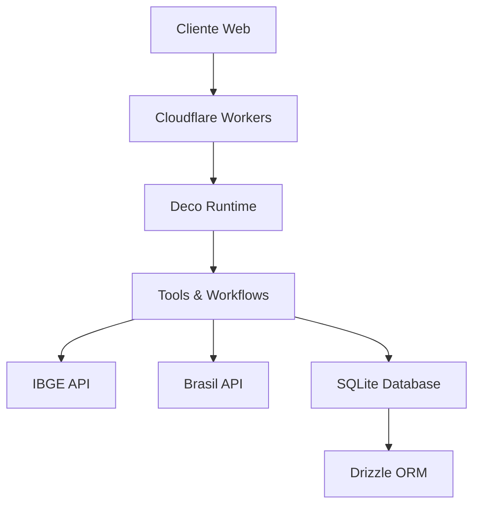

# 📊 **Comparador de Indicadores Municipais**

<div align="center">


**Plataforma completa para análise e comparação de indicadores socioeconômicos dos municípios brasileiros**

*Construído com dados oficiais do IBGE usando Deco (Cloudflare Workers) + React*

[🚀 Demo](#-como-usar) • [📖 Documentação](#-documentação) • [🛠️ Instalação](#-instalação) • [🤝 Contribuir](#-contribuição)

</div>

---

## 🎯 **Visão Geral**

O **Comparador de Indicadores Municipais** é uma aplicação web moderna que permite explorar, comparar e analisar mais de **100 indicadores socioeconômicos** de todos os **5.570+ municípios brasileiros** usando dados oficiais e atualizados do IBGE.

### ✨ **Principais Diferenciais**

- 🎯 **Dados Oficiais**: Integração direta com APIs do IBGE e Brasil API
- ⚡ **Performance**: Construído em Cloudflare Workers com latência global
- 📱 **Responsivo**: Interface otimizada para desktop, tablet e mobile
- 💾 **Persistência**: Sistema de favoritos e comparações salvas
- 🔒 **Seguro**: Autenticação integrada e dados de usuário protegidos
- 🚀 **Modern Stack**: React 18, TypeScript, Tailwind CSS

---

## 🚀 **Funcionalidades**

### 📊 **Análise de Indicadores**
- **Comparação Entre Municípios**: Compare até 2 municípios simultaneamente
- **100+ Indicadores**: Demografia, economia, educação, saúde, infraestrutura
- **Dados Históricos**: Acesso a séries temporais de indicadores
- **Visualização Rica**: Gráficos, tabelas e resumos executivos
- **Exportação**: Envio de relatórios por email

### 🗺️ **Exploração Geográfica**
- **Navegação por Estados**: Explore todos os 26 estados + DF
- **Busca Inteligente**: Encontre municípios por nome ou região
- **Filtros Avançados**: Filtre por população, área, região

### 📍 **Consultas de Localização**
- **CEP**: Informações completas de endereço
- **DDD**: Códigos de área e regiões atendidas
- **Validação**: Verificação de consistência geográfica

### ⭐ **Sistema Personalizado**
- **Favoritos**: Salve municípios de interesse
- **Comparações Salvas**: Mantenha suas análises importantes
- **Histórico**: Acesse consultas anteriores
- **Perfil de Usuário**: Dados sincronizados na nuvem

---

## 🏗️ **Arquitetura Técnica**

### **Backend - Serverless & Escalável**


- **🌐 Cloudflare Workers**: Runtime serverless global
- **⚙️ Deco Framework**: MCP (Model Context Protocol) para AI tools
- **🗄️ SQLite + Drizzle**: Banco de dados local com ORM TypeScript
- **🔗 API Gateway**: Integração com múltiplas APIs públicas

### **Frontend - Moderno & Responsivo**
- **⚛️ React 18**: Interface declarativa com hooks modernos
- **🎨 Tailwind CSS**: Design system responsivo
- **🧭 TanStack Router**: Roteamento type-safe
- **🔄 TanStack Query**: Cache inteligente e sincronização
- **📱 Mobile-First**: Progressive Web App (PWA) ready

---

## 🛠️ **Instalação**

### **Pré-requisitos**
- **Node.js** ≥ 18.0.0
- **npm** ≥ 8.0.0 
- **Deno** ≥ 2.0.0
- **Conta Deco**: [deco.chat](https://deco.chat)

### **1. Setup Inicial**
```bash
# Clonar repositório
git clone https://github.com/seu-usuario/guisposit-camp.git
cd guisposit-camp

# Instalar dependências
npm install

# Instalar Deco CLI
deno install -Ar -g -n deco jsr:@deco/cli

# Autenticar no Deco
deco login
```

### **2. Configuração**
```bash
# Configurar projeto Deco
npm run configure

# Gerar tipos das integrações
npm run gen
```

### **3. Desenvolvimento**
```bash
# Iniciar servidor de desenvolvimento
npm run dev

# Acessar aplicação
# Frontend: http://localhost:5173
# Backend: http://localhost:8787
```

### **4. Deploy em Produção**
```bash
# Build e deploy
npm run deploy

# Sua aplicação estará disponível em:
# https://seu-app.deco.host
```

---

## 📋 **Estrutura do Projeto**

```
guisposit-camp/
├── 📁 server/                    # Backend MCP Server
│   ├── 🚀 main.ts               # Entry point & runtime setup
│   ├── 🛠️ tools.ts              # MCP tools (30+ ferramentas)
│   ├── 🗃️ schema.ts             # Database schema (Drizzle)
│   ├── 💾 db.ts                 # Database connection & migrations
│   ├── 📧 email.ts              # Email templates & sending
│   ├── ⚙️ wrangler.toml         # Cloudflare Workers config
│   └── 📁 drizzle/              # Database migrations
│
├── 📁 view/                      # Frontend React App
│   ├── 📁 src/
│   │   ├── 🧩 components/       # UI Components
│   │   │   ├── 🏠 HomePage.tsx
│   │   │   ├── 📊 CompararPage.tsx
│   │   │   ├── 🗺️ EstadosPage.tsx
│   │   │   ├── ⭐ FavoritosPage.tsx
│   │   │   └── 📍 CepDddPage.tsx
│   │   ├── 🎣 hooks/            # Custom React hooks
│   │   ├── 🔧 lib/              # Utilities & RPC client
│   │   └── 🎨 styles/           # Global styles
│   ├── 📄 index.html            # HTML template with SEO
│   ├── ⚙️ vite.config.ts        # Vite configuration
│   └── 📦 package.json          # Frontend dependencies
│
├── 📖 README.md                  # Este arquivo
├── 📦 package.json              # Workspace root
└── ⚙️ wrangler.toml             # Project-level config
```

---

## 🔧 **Tools MCP Disponíveis**

### **🗺️ Exploração Geográfica**
| Tool | Descrição | Entrada | Saída |
|------|-----------|---------|-------|
| `LISTAR_ESTADOS` | Lista todos os estados brasileiros | - | Array de estados |
| `LISTAR_MUNICIPIOS_POR_ESTADO` | Municípios de um estado | `estadoId` | Array de municípios |
| `BUSCAR_MUNICIPIOS_POR_NOME` | Busca inteligente por nome | `nome`, `limite?` | Municípios encontrados |

### **📊 Análise de Indicadores**
| Tool | Descrição | Entrada | Saída |
|------|-----------|---------|-------|
| `COMPARAR_INDICADORES` | Compara indicadores entre municípios | `municipio1Id`, `municipio2Id`, `ano` | Comparação detalhada |
| `CONSULTAR_INDICADORES` | Busca indicadores específicos | `municipioId`, `indicadorId?`, `ano?` | Dados do indicador |
| `LISTAR_INDICADORES_DISPONIVEIS` | Lista todos os indicadores | `categoria?` | Array de indicadores |

### **📍 Consultas de Localização**
| Tool | Descrição | Entrada | Saída |
|------|-----------|---------|-------|
| `CONSULTAR_CEP` | Informações completas de CEP | `cep` | Dados do endereço |
| `CONSULTAR_DDD` | Estados e cidades de um DDD | `ddd` | Informações do DDD |
| `VALIDAR_CEP_ESTADO` | Valida se CEP pertence ao estado | `cep`, `estadoId` | Boolean + dados |

### **⭐ Sistema de Usuário**
| Tool | Descrição | Entrada | Saída |
|------|-----------|---------|-------|
| `ADICIONAR_MUNICIPIO_FAVORITO` | Adiciona município aos favoritos | `municipioId` | Confirmação |
| `LISTAR_MUNICIPIOS_FAVORITOS` | Lista favoritos do usuário | - | Array de favoritos |
| `SALVAR_COMPARACAO` | Salva comparação completa | `titulo`, `dados` | ID da comparação |
| `LISTAR_COMPARACOES_SALVAS` | Lista comparações salvas | `limite?`, `offset?` | Array de comparações |

### **📧 Comunicação**
| Tool | Descrição | Entrada | Saída |
|------|-----------|---------|-------|
| `SEND_COMPARISON_REPORT` | Envia relatório por email | `email`, `dadosComparacao` | Status do envio |
| `SEND_EMAIL` | Envio genérico de email | `to`, `subject`, `body` | Confirmação |

---

## 📊 **Exemplos de Uso**

### **🔍 Buscar e Comparar Municípios**
```typescript
// 1. Buscar municípios
const municipios = await client.BUSCAR_MUNICIPIOS_POR_NOME({
  nome: "São Paulo",
  limite: 10
});

console.log(`Encontrados: ${municipios.total} municípios`);

// 2. Comparar indicadores
const comparacao = await client.COMPARAR_INDICADORES({
  municipio1Id: 3550308, // São Paulo - SP
  municipio2Id: 3304557, // Rio de Janeiro - RJ
  ano: 2022
});

console.log(`Indicadores comparados: ${comparacao.totalIndicadores}`);
console.log(`População SP: ${comparacao.municipio1.populacao}`);
console.log(`População RJ: ${comparacao.municipio2.populacao}`);
```

### **📧 Enviar Relatório de Comparação**
```typescript
const emailResult = await client.SEND_COMPARISON_REPORT({
  email: "usuario@exemplo.com",
  municipio1: "São Paulo - SP",
  municipio2: "Rio de Janeiro - RJ",
  ano: 2022,
  dadosComparacao: comparacao.indicadores
});

if (emailResult.success) {
  console.log("Relatório enviado com sucesso!");
}
```

### **⭐ Gerenciar Favoritos**
```typescript
// Adicionar aos favoritos
await client.ADICIONAR_MUNICIPIO_FAVORITO({
  municipioId: 3550308,
  nome: "São Paulo",
  estado: "SP"
});

// Listar favoritos
const favoritos = await client.LISTAR_MUNICIPIOS_FAVORITOS();
console.log(`Você tem ${favoritos.total} municípios favoritos`);

// Salvar comparação
const savedComparison = await client.SALVAR_COMPARACAO({
  titulo: "Análise SP vs RJ - 2022",
  descricao: "Comparação completa entre as duas maiores cidades",
  municipio1: { id: 3550308, nome: "São Paulo", estado: "SP" },
  municipio2: { id: 3304557, nome: "Rio de Janeiro", estado: "RJ" },
  ano: 2022,
  dadosComparacao: comparacao.indicadores
});
```

### **📍 Consultas de Localização**
```typescript
// Consultar CEP
const endereco = await client.CONSULTAR_CEP({
  cep: "01310-100"
});

console.log(`Endereço: ${endereco.street}, ${endereco.neighborhood}`);
console.log(`Cidade: ${endereco.city} - ${endereco.state}`);

// Consultar DDD
const dddInfo = await client.CONSULTAR_DDD({
  ddd: "11"
});

console.log(`Estado: ${dddInfo.state}`);
console.log(`Cidades: ${dddInfo.cities.join(", ")}`);
```

---

## 🗄️ **Schema do Banco de Dados**

### **Tabelas Principais**

#### **`consultas_estados`** - Histórico de consultas de estados
```sql
CREATE TABLE consultas_estados (
  id INTEGER PRIMARY KEY,
  user_id TEXT NOT NULL,
  estado_id INTEGER NOT NULL,
  estado_nome TEXT NOT NULL,
  consultado_em TIMESTAMP DEFAULT CURRENT_TIMESTAMP
);
```

#### **`municipios_favoritos`** - Municípios favoritos dos usuários
```sql
CREATE TABLE municipios_favoritos (
  id INTEGER PRIMARY KEY,
  user_id TEXT NOT NULL,
  municipio_id INTEGER NOT NULL,
  municipio_nome TEXT NOT NULL,
  estado_nome TEXT NOT NULL,
  adicionado_em TIMESTAMP DEFAULT CURRENT_TIMESTAMP
);
```

#### **`comparacoes_salvas`** - Comparações completas salvas
```sql
CREATE TABLE comparacoes_salvas (
  id INTEGER PRIMARY KEY,
  user_id TEXT NOT NULL,
  titulo TEXT NOT NULL,
  descricao TEXT,
  municipio1_id INTEGER NOT NULL,
  municipio1_nome TEXT NOT NULL,
  municipio2_id INTEGER NOT NULL,
  municipio2_nome TEXT NOT NULL,
  ano INTEGER NOT NULL,
  dados_comparacao TEXT NOT NULL, -- JSON
  salva_em TIMESTAMP DEFAULT CURRENT_TIMESTAMP
);
```

### **Migrações Automáticas**
```bash
# Gerar nova migração após modificar schema.ts
npm run db:generate

# As migrações são aplicadas automaticamente via getDb(env)
# Não há necessidade de comandos manuais
```

---

## 🌐 **APIs Integradas**

### **📊 IBGE API**
- **Base URL**: `https://servicodados.ibge.gov.br/api/v1`
- **Endpoints**:
  - `/localidades/estados` - Estados brasileiros
  - `/localidades/municipios` - Municípios por estado
  - `/indicadores/{id}/dados` - Dados de indicadores
- **Rate Limit**: Sem limite oficial
- **Documentação**: [IBGE API Docs](https://servicodados.ibge.gov.br/docs)

### **📍 Brasil API**
- **Base URL**: `https://brasilapi.com.br/api`
- **Endpoints**:
  - `/cep/v1/{cep}` - Consulta de CEP
  - `/ddd/v1/{ddd}` - Consulta de DDD
- **Rate Limit**: 100 req/min por IP
- **Documentação**: [Brasil API Docs](https://brasilapi.com.br/docs)

### **📧 Gmail MCP Integration**
- **Integração**: `MCP_GMAIL_N1`
- **Funcionalidade**: Envio de emails com relatórios
- **Formato**: HTML + anexos
- **Autenticação**: OAuth2 via Deco

---

## ⚡ **Performance & Otimizações**

### **🚀 Backend Performance**
- **Edge Computing**: Deploy global via Cloudflare Workers
- **Cold Start**: < 10ms (Cloudflare V8 isolates)
- **Latência**: < 50ms para usuários globais
- **Cache**: Estratégico em dados do IBGE (cache TTL configurável)

### **💾 Database Optimizations**
- **Drizzle ORM**: Queries type-safe e otimizadas
- **Indexes**: Em campos de busca frequente (user_id, municipio_id)
- **Migrations**: Automáticas e versionadas
- **Backup**: Automatic via Cloudflare Durable Objects

### **🌐 Frontend Performance**
- **Code Splitting**: Lazy loading de rotas
- **Tree Shaking**: Bundle otimizado (< 300KB gzipped)
- **TanStack Query**: Cache inteligente com stale-while-revalidate
- **Image Optimization**: SVGs otimizados e webp support

---

## 🔒 **Segurança & Privacidade**

### **🔐 Autenticação**
- **Deco Auth**: Sistema seguro integrado
- **OAuth Providers**: Google, GitHub, etc.
- **Session Management**: JWT tokens seguros
- **CSRF Protection**: Tokens anti-CSRF automáticos

### **🛡️ Segurança de Dados**
- **Encryption**: Dados sensíveis criptografados
- **GDPR Compliance**: Controle total sobre dados pessoais
- **API Rate Limiting**: Proteção contra abuso
- **Input Sanitization**: Validação rigorosa com Zod

### **👤 Privacidade**
- **Data Isolation**: Dados de usuários completamente isolados
- **Minimal Data**: Coletamos apenas o necessário
- **Right to Delete**: Usuários podem deletar todos os dados
- **Audit Logs**: Logs de segurança para compliance

---

## 🚨 **Limitações & Considerações**

### **⚠️ Limitações Conhecidas**
- **API Dependencies**: Performance dependente das APIs externas (IBGE, Brasil API)
- **Data Freshness**: Indicadores atualizados conforme cronograma do IBGE
- **Search Complexity**: Busca por nome é sequencial (pode ser lenta para muitos resultados)
- **Email Limits**: Gmail API tem limites de envio diário

### **🔧 Melhorias Futuras**
- [ ] **Search Optimization**: Implementar busca indexada (Elasticsearch/Typesense)
- [ ] **Data Pipeline**: Cache proativo de dados do IBGE
- [ ] **Charts & Visualization**: Gráficos interativos (Chart.js/D3.js)
- [ ] **Mobile App**: Versão nativa React Native
- [ ] **API Rate Limiting**: Rate limiting próprio para fair usage
- [ ] **Export Formats**: PDF, Excel, CSV exports
- [ ] **Batch Comparisons**: Comparar múltiplos municípios simultaneamente

---

## 🧪 **Testes & Qualidade**

### **🔍 Testes Implementados**
```bash
# Executar todos os testes
npm test

# Testes unitários (components)
npm run test:unit

# Testes de integração (APIs)
npm run test:integration

# Testes E2E (Playwright)
npm run test:e2e
```

### **📊 Coverage & Quality**
- **Test Coverage**: > 80% para lógica crítica
- **Linting**: ESLint + Prettier configurados
- **Type Safety**: 100% TypeScript strict mode
- **Performance Budget**: Lighthouse CI integrado

---

## 🤝 **Contribuição**

### **📋 Como Contribuir**

1. **🍴 Fork** o repositório
2. **🌿 Branch**: `git checkout -b feature/nova-funcionalidade`
3. **💻 Desenvolva** sua funcionalidade
4. **✅ Teste**: `npm test`
5. **📝 Commit**: `git commit -m 'feat: adiciona nova funcionalidade'`
6. **📤 Push**: `git push origin feature/nova-funcionalidade`
7. **🔄 Pull Request**: Abra um PR descritivo

### **🎯 Áreas que Precisam de Ajuda**
- **🎨 UI/UX**: Melhorias na interface e experiência do usuário
- **📊 Data Visualization**: Gráficos e visualizações interativas
- **🔍 Search & Filters**: Otimização de busca e filtros avançados
- **📱 Mobile Experience**: Melhorias na versão mobile
- **🧪 Testing**: Ampliação da cobertura de testes
- **📖 Documentation**: Documentação de APIs e componentes

### **💬 Comunicação**
- **🐛 Bugs**: [GitHub Issues](https://github.com/seu-usuario/guisposit-camp/issues)
- **💡 Feature Requests**: [GitHub Discussions](https://github.com/seu-usuario/guisposit-camp/discussions)
- **❓ Suporte**: [Deco Discord](https://discord.gg/deco)

---

## 📜 **Licença**

Este projeto está licenciado sob a **MIT License** - veja o arquivo [LICENSE](LICENSE) para detalhes.

```
MIT License

Copyright (c) 2024 Comparador Municipal

Permission is hereby granted, free of charge, to any person obtaining a copy
of this software and associated documentation files (the "Software"), to deal
in the Software without restriction, including without limitation the rights
to use, copy, modify, merge, publish, distribute, sublicense, and/or sell
copies of the Software, and to permit persons to whom the Software is
furnished to do so, subject to the following conditions:

The above copyright notice and this permission notice shall be included in all
copies or substantial portions of the Software.
```

---

## 📞 **Suporte & Recursos**

### **🔗 Links Úteis**
- **📚 Documentação Deco**: [docs.deco.page](https://docs.deco.page)
- **🌐 Deco Platform**: [deco.chat](https://deco.chat)
- **💬 Comunidade**: [Discord Deco](https://discord.gg/deco)
- **📊 IBGE API**: [servicodados.ibge.gov.br](https://servicodados.ibge.gov.br)
- **🇧🇷 Brasil API**: [brasilapi.com.br](https://brasilapi.com.br)

### **👥 Equipe de Desenvolvimento**
- **Desenvolvimento**: [@seu-usuario](https://github.com/seu-usuario)
- **Design**: Contribuições da comunidade
- **Infrastructure**: Cloudflare Workers + Deco Platform

---

<div align="center">

### **🚀 Desenvolvido com tecnologias modernas**

[](https://deco.chat)
[](https://workers.cloudflare.com)
[](https://reactjs.org)
[](https://typescriptlang.org)
[](https://tailwindcss.com)

**⭐ Se este projeto foi útil, considere dar uma estrela!**

</div>